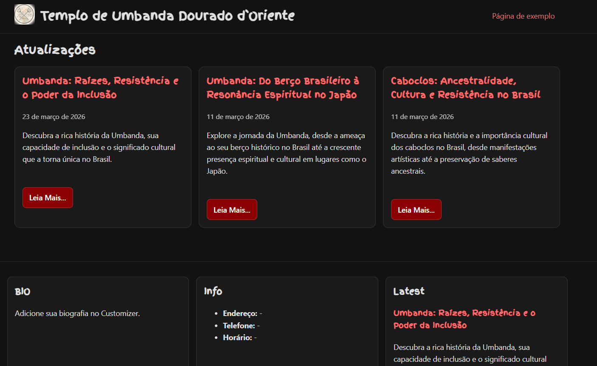

# Quimbanda-JP (Tema WordPress)

## Estrutura recomendada

- Assets/Fonts/FingerPaint.ttf
- functions.php
- header.php
- index.php
- footer.php
- style.css
- sitemap.xml (exemplo)

## Observações de padrão WordPress

- `header.php` e `footer.php` separados para reutilização.
- `functions.php` com:
  - `after_setup_theme`
  - `wp_enqueue_scripts`
  - `widgets_init`
  - `customize_register`
- Suporte a `title-tag`, `post-thumbnails`, `html5`, `custom-logo` e menu principal.
- Text domain: `quimbanda-jp`.

## Sitemap XML

WordPress já gera sitemap automático em:

- `/wp-sitemap.xml`

O arquivo `sitemap.xml` deste tema é apenas um modelo estático.

---

Desenvolvido por [Andre Silva TsC](https://andretsc.dev)

---

## Mudanças recentes (26/03/2026)

- Verificação completa dos arquivos PHP do tema (`php -l`): sem erros de sintaxe.
- Identificado o motivo do ZIP grande: ZIPs antigos estavam dentro da pasta do tema e eram incluídos no pacote novo.
- Removidos ZIPs antigos da raiz para evitar empacotamento recursivo.
- Adicionado o script `build-theme-zip.ps1` para gerar pacote limpo.

### Gerar ZIP correto do tema

No PowerShell, dentro da pasta do tema:

`./build-theme-zip.ps1 -Version 1.2.4`

O script já exclui automaticamente:

- pastas de desenvolvimento (`.git`, `.vscode`)
- arquivos `.zip` antigos
- arquivos `.md`
- pasta temporária de build

Assim o arquivo final fica pronto para **Aparência > Temas > Enviar tema** sem inchar tamanho.

---

## Mudanças recentes (26/03/2026 - compatibilidade WP/plugins)

- Adicionados templates de compatibilidade do WordPress sem alterar o visual base:
  - `single.php`
  - `page.php`
  - `archive.php`
  - `search.php`
  - `404.php`
  - `comments.php`
  - `sidebar.php`
- Adicionado registro de widget area (`sidebar-1`) para suporte a plugins/widgets.
- Adicionado carregamento do script `comment-reply` em páginas singulares com comentários encadeados.
- Adicionados suportes extras de tema para melhor compatibilidade:
  - `customize-selective-refresh-widgets`
  - `wp-block-styles`
  - `responsive-embeds`
  - `align-wide`
- Confirmado e ajustado o comportamento de background:
  - quando for **imagem**, o fundo aparece atrás do conteúdo (`qjp-has-bg-image`)
  - quando for **vídeo**, o fundo aparece atrás do conteúdo (`qjp-has-bg-video`)
  - ajuste aplicado para manter `body` transparente nesses casos, preservando o layout atual.

---

## Atualização técnica (28/03/2026) — Axé + WordPress padrão

Este tema foi consolidado para comunicar a espiritualidade do Axé com presença digital moderna, limpa e responsiva, mantendo compatibilidade com o ecossistema WordPress.

### Estrutura SEO e semântica

- Novo template de página: `page-axe.php`
- Hierarquia automática de conteúdo:
  - `H1`: título da página (nome do terreiro/casa)
  - `H2`: blocos principais (Sobre, Trabalhos, Consultas, Endereços)
  - `H3`: itens internos de cada bloco
- Uso do Loop padrão do WordPress para máxima compatibilidade com plugins de SEO (Yoast, RankMath e similares).

### Visual e responsividade

- Logo otimizado para fundo escuro/claro com:
  - `object-fit: contain`
  - `background: transparent`
  - `mix-blend-mode: multiply`
- Paleta sólida do tema preservada: Preto + Vermelho, com suporte a destaque dourado/branco.
- Menu e imagens com ajustes para telas pequenas (flex-wrap no menu e imagens fluidas).

### Rodapé com múltiplos endereços (Magazines/Unidades)

Você pode usar **duas abordagens**:

1. **Customizer**
   - Campo: `Múltiplos Endereços / Unidades`
   - Informe um endereço por linha.

2. **Widgets**
   - Área: `Unidades / Endereços (Rodapé)`
   - Permite gerenciar várias unidades com widgets nativos/plugins.

### Blocos Gutenberg para galeria ritualística

- Categoria de padrões: `Quimbanda-JP Axé`
- Pattern incluso: `Galeria de Rituais e Entidades`
- Arquivo: `inc/block-patterns.php`

### Campos personalizados para `page-axe.php`

No editor da página, use Campos Personalizados com as chaves:

- `qjp_trabalhos`
- `qjp_consultas`
- `qjp_enderecos`

Pode cadastrar múltiplos valores ou um valor com uma linha por item.

### Arquivos-chave atualizados

- `style.css` (descrição do tema + responsividade + logo clean)
- `functions.php` (suportes WP, widgets, customizer e integração de patterns)
- `page-axe.php` (template limpo: Header > Content > Footer)
- `footer.php` (unidades múltiplas por customizer/widgets)

---

## Atualização técnica (28/03/2026) — Atualização via GitHub com escolha do usuário

- Mantido o cron semanal de verificação (`qjp_weekly_update_check`).
- A verificação continua comparando versão instalada com a versão do GitHub.
- Nova preferência no painel para o usuário escolher se deseja atualização automática semanal:
  - opção salva em `qjp_theme_auto_update_enabled`
  - quando habilitada, se houver nova versão, o tema atualiza automaticamente com backup e rollback de segurança
  - quando desabilitada, o sistema apenas avisa e permite atualização manual
- Nova tela de atualizações do tema em **Aparência > Atualizações Quimbanda-JP** com:
  - botão “Verificar atualizações agora”
  - botão “Atualizar agora (com backup automático)”
  - chave para ativar/desativar autoatualização semanal
